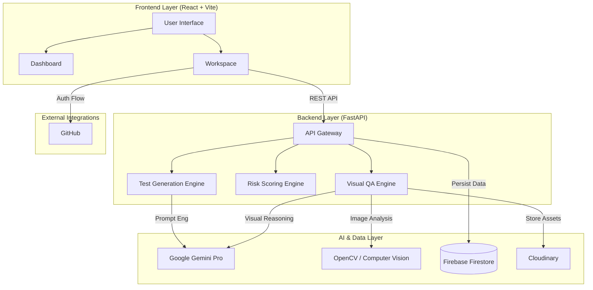
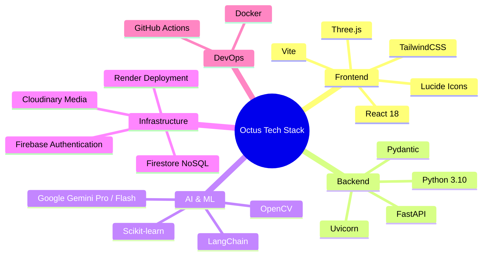

# <div align="center">🐙 Octus</div>

<div align="center">
  <h2>The AI-Powered Project Manager & QA Engineer in One Platform</h2>
  <p><i>Predict Delays. Generate Tests. Validate UI. Shipping software has never been this intelligent.</i></p>
  
  [](https://reactjs.org/)
  [](https://vitejs.dev/)
  [](https://fastapi.tiangolo.com/)
  [](https://deepmind.google/technologies/gemini/)
  [](https://firebase.google.com/)
</div>

---

## � The Problem
Software delivery is broken. 
*   **70% of projects** miss deadlines due to poor estimation.
*   **QA is a bottleneck**, with manual testing consuming 40% of development time.
*   **Design drift** occurs when implementation silently deviates from Figma designs.
*   **Context switching** between Jira, GitHub, and Testing tools kills developer productivity.

## 💡 The Octus Solution
**Octus** is an autonomous AI agent that orchestrates your software lifecycle. It doesn't just manage tasks; it *understands* them.

1.  **AI Project Manager**: Predicts risks by analyzing team velocity and historical data.
2.  **Autonomous QA Engineer**: Converts user stories into executable test scripts instantly.
3.  **Visual Design Guardian**: Uses Computer Vision to catch UI bugs and design regressions.

---

## 🏗️ System Architecture

High-level overview of how Octus integrates with your ecosystem.



---

## ⚡ Tech Stack

A modern, scalable architecture designed for performance and AI integration.



---

## 🤖 AI Workflow: Autonomous Test Generation

How Octus turns a simple User Story into a full Test Suite in seconds.

```mermaid
sequenceDiagram
    participant User
    participant Frontend
    participant Backend
    participant LLM as Google Gemini
    participant GitHub

    User->>Frontend: Enters User Story & Selects Repo
    Frontend->>Backend: POST /generate-tests (Story + Repo Context)
    
    rect rgb(20, 20, 40)
        Note right of Backend: Retrieval Augmented Generation (RAG)
        Backend->>GitHub: Fetch related code files
        GitHub-->>Backend: Return source code
        Backend->>LLM: Analyze Code + Story -> Generate Scenarios
        LLM-->>Backend: Return Gherkin/Pytest Cases
    end
    
    Backend-->>Frontend: Return Structured Test Suite
    Frontend->>User: Display Test Cases
    
    User->>Frontend: Click "Run Tests"
    Frontend->>Backend: Trigger CI Pipeline
    Backend->>GitHub: Dispatch Workflow / Run Actions
```



---

## ✨ Key Features Breakdown

### 1. 🧠 Predictive Planning & Risk Scoring
Unlike traditional tools that just list tasks, Octus **scores** them.
*   **Velocity Analysis**: "Based on John's past performance, this task will likely take 3 days, not 1."
*   **Risk Heatmap**: Visualizes which parts of your project are at risk of missing deadlines.

### 2. 🧪 One-Click Test Generation
Stop writing boilerplate.
*   **Input**: "As a user, I want to login with 2FA."
*   **Output**: 15+ Test Cases including Happy Path, Edge Cases (Wrong OTP, Expired Code), and Security Checks.
*   **Format**: Exports to Gherkin (`.feature`), Pytest, or JSON.

### 3. 👁️ Visual QA & Regression
*   **Design-to-Code Validation**: Upload a Figma screenshot and a screenshot of your localized app. Octus highlights pixel deviations and layout shifts.
*   **UX Flow Analysis**: Upload a sequence of screens. Octus uses Vision AI to validate if the user journey makes logical sense.

---

## 🚀 Getting Started

### Prerequisites
*   Node.js 18+
*   Python 3.10+
*   Firebase Project Credentials

### Installation

1.  **Clone the Repository**
    ```bash
    git clone https://github.com/your-org/octus.git
    cd octus
    ```

2.  **Install Dependencies**
    ```bash
    npm install
    ```

3.  **Configure Environment**
    Create `.env` file:
    ```env
    VITE_AI_TEST_GEN_BACKEND_URL=https://threerd-back.onrender.com
    VITE_FIREBASE_API_KEY=...
    ```

4.  **Run Application**
    ```bash
    npm run dev
    ```

---

## 👥 Contributors
Built for the **[Hackathon Name]** by **[Team Name]**.
