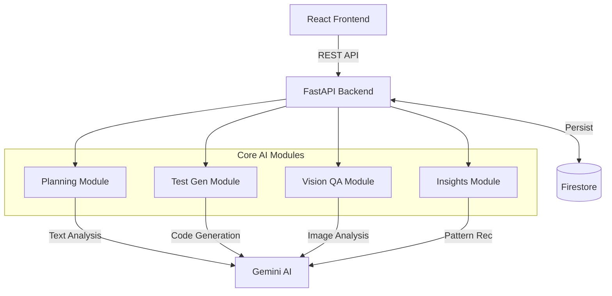
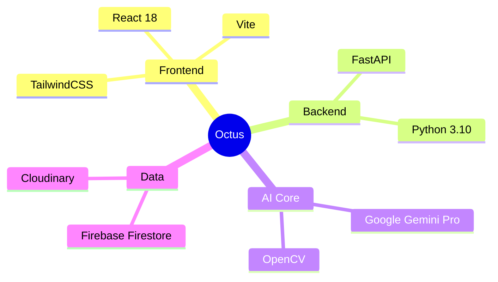

# <div align="center">🐙 Octus</div>

<div align="center">
  <h2>AI-Powered Intelligent Project Management & QA Platform</h2>
  <p><i>Predict Delays. Generate Tests. Validate UI. Shipping software has never been this intelligent.</i></p>
  
  [](https://reactjs.org/)
  [](https://fastapi.tiangolo.com/)
  [](https://deepmind.google/technologies/gemini/)
  [](https://firebase.google.com/)
</div>

---

## 🏗️ System Architecture

A clean, modular architecture driving four intelligent engines. Each module operates independently but shares a unified data layer.



---

## ⚡ Tech Stack



---

## 🚀 Core Features — Deep Dive

### 1. AI-Assisted Planning
**Because deadlines shouldn't be a surprise.**
This module continuously monitors project task data, team velocity, and dependency chains. A Gemini NLP model interprets structured JSON task payloads and produces human-readable risk summaries, priority recommendations, and predictive timelines. It surfaces which tasks are likely to slip and which team members are overloaded *before* the sprint review.

| Aspect | Description |
| :--- | :--- |
| **INPUT** | Task list, sprint velocity history, team capacity, dependency graph. |
| **OUTPUT** | Risk score (0–100), predicted delay days, overload heatmap, priority recommendations. |
| **ARCH** | FastAPI receives task JSON → Gemini NLP prompt → Structured Pydantic models → Stored in Firestore. |

### 2. Intelligent Test Generation
**Stop writing boilerplate. Start testing features.**
Converts user stories written in plain English into structured, executable test cases — including happy paths, edge cases, and negative scenarios. It uses a Retrieval-Augmented Generation (RAG) approach to fetch relevant code context from the repository, ensuring the tests match the actual implementation. No blank test files. Just describe the feature and get a full test suite.

| Aspect | Description |
| :--- | :--- |
| **INPUT** | User story text, acceptance criteria, component context (e.g., 'Login Page'). |
| **OUTPUT** | Full test case set: Happy paths, Edge cases, Security scenarios. Exportable as `.feature` or `.json`. |
| **ARCH** | User story → RAG (Fetch Repo Context) → Gemini Few-Shot Prompt → Generated Test Suite. |

### 3. Vision-Based UI QA
**Pixel-perfect design implementation, guaranteed.**
Uses Gemini Vision and OpenCV to perform pixel-level comparisons between your localized build and the reference designs. It goes beyond simple image diffing by adding semantic understanding — it knows a "Submit button" from a "Cancel button" and flags layout shifts, missing elements, or colour anomalies that might affect user experience.

| Aspect | Description |
| :--- | :--- |
| **INPUT** | Baseline screenshot (v1), Comparison screenshot (v2), element labels. |
| **OUTPUT** | Visual diff overlay, element shift report, layout anomaly detection. |
| **ARCH** | React Upload → OpenCV Processing → Gemini Multimodal Analysis → Annotated Diff Image. |

### 4. End-to-End Quality Insights
**The "Go/No-Go" decision, automlated.**
Aggregates data from all three other modules to compute a holistic **Release Readiness Score**. A Gemini NLP analytics layer ingests defect counts, test pass rates, and visual regression scores to identify trend lines and recurring failure hotspots. It emits a plain-English release recommendation so engineering leads can make data-driven decisions.

| Aspect | Description |
| :--- | :--- |
| **INPUT** | Defect logs, test pass rates, visual regression scores, risk signals. |
| **OUTPUT** | Release Readiness Score (0–100), defect trend charts, localized hot-spot analysis. |
| **ARCH** | Cross-module Aggregation → Gemini Data Analysis → Narrative Summary → Dashboard render. |

---

## 🚀 Getting Started

1.  **Clone**
    ```bash
    git clone https://github.com/your-org/octus.git
    cd octus
    ```

2.  **Install**
    ```bash
    npm install
    ```

3.  **Run**
    ```bash
    npm run dev
    ```

---

## 👥 Team
Built by **Team Rudrax**.
