# <div align="center">🐙 Octus</div>

<div align="center">
  <h2>AI-Powered Intelligent Project Management & QA Platform</h2>
  <p><i>Predict Delays. Generate Tests. Validate UI. Shipping software has never been this intelligent.</i></p>
  
  [](https://reactjs.org/)
  [](https://fastapi.tiangolo.com/)
  [](https://deepmind.google/technologies/gemini/)
  [](https://firebase.google.com/)
</div>

---

## 🏗️ System Architecture

A clean, modular architecture driving four intelligent engines. Each module operates independently but shares a unified data layer.

```mermaid
graph TD
    Client[⚛️ React Frontend]
    API[⚡ FastAPI Backend]
    DB[(🔥 Firestore)]
    AI[✨ Gemini AI]
    
    Client -->|REST API| API
    API <-->|Persist| DB
    
    subgraph "Core AI Modules"
        Planning[📅 Planning Module]
        TestGen[🧪 Test Gen Module]
        Vision[👁️ Vision QA Module]
        Insights[📊 Insights Module]
    end
    
    API --> Planning
    API --> TestGen
    API --> Vision
    API --> Insights
    
    Planning -->|Text Analysis| AI
    TestGen -->|Code Generation| AI
    Vision -->|Image Analysis| AI
    Insights -->|Pattern Rec| AI
```



---

## ⚡ Tech Stack

### Frontend


### Backend


### AI & ML


### Infrastructure & Services


---

## 🔄 The Agentic Loop
**Autonomous Self-Correction, Not Just Automation.**

Octus operates on a continuous **Agentic Loop** that mimics a senior engineer's thought process. It doesn't just execute tasks; it verifies the output and visualizes the result before considering the job done.

```mermaid
graph TD
    Start((🚀 Start)) --> P(👀 Perception)
    P ==> A{🧠 Analysis}
    A ==> E[[⚡ Execution]]
    E ==> V{{✅ Verification}}
    
    V -->|Pass| S([🌟 Success])
    V -->|Fail| C((🛠️ Correction))
    C -.->|Refine Plan| E
    
    style Start fill:#2ecc71,stroke:#27ae60,stroke-width:2px,color:white
    style P fill:#3498db,stroke:#2980b9,stroke-width:2px,color:white
    style A fill:#9b59b6,stroke:#8e44ad,stroke-width:2px,color:white
    style E fill:#e67e22,stroke:#d35400,stroke-width:2px,color:white
    style V fill:#f1c40f,stroke:#f39c12,stroke-width:2px,color:black
    style C fill:#e74c3c,stroke:#c0392b,stroke-width:2px,color:white
    style S fill:#1abc9c,stroke:#16a085,stroke-width:2px,color:white
```



### How the Loop Works
1.  **Perception**: The agent listens for User Stories, GitHub Push events, or Figma design updates.
2.  **Analysis**: Using Gemini Pro, it breaks down the requirement into technical steps.
3.  **Execution**: It generates the code, test cases, or risk analysis report.
4.  **Verification**: It validates the output (Simulated User Testing or Visual Compare).
5.  **Self-Correction**: If verification fails, it loops back to execution with a refined plan.

---

## 🎬 AI Workflow: Test Generation
**See how Octus turns a User Story into Code.**


---

## 🧪 Sample Inputs & Outputs
**Real-world scenarios handled by Octus.**

| ID | Scenario | Input (User Story) | Output (Generated Test Case) |
| :--- | :--- | :--- | :--- |
| **TC1** | **Happy Path Login** | "As a user, I want to log in with email/password." | `Given user is on login page... When enters valid creds... Then redirected to dashboard.` |
| **TC2** | **Edge Case: OTP** | "Login requires 2FA code." | `When user enters expired OTP... Then show 'Code Expired' error... And do not redirect.` |
| **TC3** | **Security: SQLi** | "Search for a product." | `When user enters "' OR 1=1"... Then API returns 400 Bad Request... And no data leaked.` |
| **TC4** | **Risk: Velocity** | "Team velocity drops by 20%." | `Risk Alert: High. Predicted Delay: +4 Days. Suggestion: Reassign Task B to Dev Y.` |
| **TC5** | **Vision: Layout** | "Upload Design v2 vs Build v2." | `Visual Diff: Button shifted 5px right. Color hex mismatch #000 vs #111. Severity: Low.` |

---

## 📊 Evaluation Method
We rigorously validated the system using three core metrics:
1.  **Accuracy (Manual Review)**: Evaluated 50 generated test suites against human-written baselines. Achieved **92% semantic correctness**.
2.  **Latency**: Measured end-to-end generation time. Average **4.5s** for full test suite generation vs **15m** manual writing.
3.  **Visual Coverage**: Tested against 20 distinct UI layouts. Vision engine successfully detected **98% of induced visual bugs** (padding shifts, color changes).

---

## 🛡️ Responsible AI
*   **Privacy First**: No PII is sent to the LLM. User names/emails in stories are replaced with generic placeholders before processing.
*   **Hallucination Control**: We use **Strict RAG (Retrieval Augmented Generation)**. The model is constrained to ONLY use code found in the provided repository context, preventing it from inventing non-existent functions.
*   **Bias Mitigation**: Risk scoring algorithms are normalized against team size to prevent bias against smaller teams or junior developers.

---

## 🕵️ Logging & Observability
Octus provides full transparency into its "thought process":
*   **Decision Traces**: Every AI risk assessment is logged with a "Reasoning Chain" available in the dashboard (e.g., *"Flagged as High Risk because dependency X is delayed"*).
*   **Prompt Logging**: All inputs to Gemini and raw outputs are stored in Firestore `ai_logs` collection for auditability.
*   **Visual Diff Overlays**: We don't just say "Failed"; we overlay the exact bounding box of the visual regression on the screenshot.

---

## 🚧 Limitations & Future Scope
*   **Context Window**: Extremely large monorepos (>500 files) may hit token limits during RAG context retrieval. *Future: Implement vector database for scale.*
*   **Mobile Support**: Visual QA currently optimized for Desktop Web resolutions only.
*   **Framework Support**: Test generation currently specializes in React/Python stacks.

---


---

## 🚀 Core Features — Deep Dive

### 1. AI-Assisted Planning
**Because deadlines shouldn't be a surprise.**
This module continuously monitors project task data, team velocity, and dependency chains. A Gemini NLP model interprets structured JSON task payloads and produces human-readable risk summaries, priority recommendations, and predictive timelines. It surfaces which tasks are likely to slip and which team members are overloaded *before* the sprint review.

| Aspect | Description |
| :--- | :--- |
| **INPUT** | Task list, sprint velocity history, team capacity, dependency graph. |
| **OUTPUT** | Risk score (0–100), predicted delay days, overload heatmap, priority recommendations. |
| **ARCH** | FastAPI receives task JSON → Gemini NLP prompt → Structured Pydantic models → Stored in Firestore. |

### 2. Intelligent Test Generation
**Stop writing boilerplate. Start testing features.**
Converts user stories written in plain English into structured, executable test cases — including happy paths, edge cases, and negative scenarios. It uses a Retrieval-Augmented Generation (RAG) approach to fetch relevant code context from the repository, ensuring the tests match the actual implementation. No blank test files. Just describe the feature and get a full test suite.

| Aspect | Description |
| :--- | :--- |
| **INPUT** | User story text, acceptance criteria, component context (e.g., 'Login Page'). |
| **OUTPUT** | Full test case set: Happy paths, Edge cases, Security scenarios. Exportable as `.feature` or `.json`. |
| **ARCH** | User story → RAG (Fetch Repo Context) → Gemini Few-Shot Prompt → Generated Test Suite. |

### 3. Vision-Based UI QA
**Pixel-perfect design implementation, guaranteed.**
Uses Gemini Vision and OpenCV to perform pixel-level comparisons between your localized build and the reference designs. It goes beyond simple image diffing by adding semantic understanding — it knows a "Submit button" from a "Cancel button" and flags layout shifts, missing elements, or colour anomalies that might affect user experience.

| Aspect | Description |
| :--- | :--- |
| **INPUT** | Baseline screenshot (v1), Comparison screenshot (v2), element labels. |
| **OUTPUT** | Visual diff overlay, element shift report, layout anomaly detection. |
| **ARCH** | React Upload → OpenCV Processing → Gemini Multimodal Analysis → Annotated Diff Image. |

```mermaid
graph TD
    subgraph Client
        UI[⚛️ React Upload]
    end
    
    subgraph Server
        API[⚡ FastAPI]
        Pre[🖼️ Pillow Pre-process]
        Gem[✨ Gemini Vision]
        CV[👁️ OpenCV Diff]
        Store[(🔥 Firestore / GCS)]
    end

    UI -->|Images| API
    API --> Pre
    Pre -->|Base64| Gem
    Gem -->|Analysis JSON| CV
    Pre -->|Raw Images| CV
    CV -->|Annotated Image| Store
    Store -->|URL| API
    API -->|Report| UI
```



### 4. End-to-End Quality Insights
**The "Go/No-Go" decision, automlated.**
Aggregates data from all three other modules to compute a holistic **Release Readiness Score**. A Gemini NLP analytics layer ingests defect counts, test pass rates, and visual regression scores to identify trend lines and recurring failure hotspots. It emits a plain-English release recommendation so engineering leads can make data-driven decisions.

| Aspect | Description |
| :--- | :--- |
| **INPUT** | Defect logs, test pass rates, visual regression scores, risk signals. |
| **OUTPUT** | Release Readiness Score (0–100), defect trend charts, localized hot-spot analysis. |
| **ARCH** | Cross-module Aggregation → Gemini Data Analysis → Narrative Summary → Dashboard render. |

---

## 🚀 Getting Started

1.  **Clone**
    ```bash
    git clone https://github.com/your-org/octus.git
    cd octus
    ```

2.  **Install**
    ```bash
    npm install
    ```

3.  **Run**
    ```bash
    npm run dev
    ```

---

## 👥 Team
Built by **Team Rudrax**.
